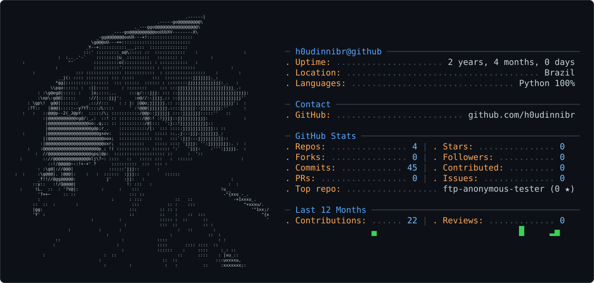

### Heya! I'm h0udinni! 

Cybersecurity analyst based in Brazil, with hands-on experience in cyber defense operations.

I design automated cybersecurity tools and simple malwares. 

Most projects are built with Python, Powershell and Bash.

And I also share what I learn about design engineering on my [Linkedin](https://www.linkedin.com/in/nicolas-santos-security/).

#### Fun facts
- I don’t like soda;
- Mob Psycho 100 is my favorite anime.
- Hobbies: Play guitar and learn robotics.

### My Contribution Graph
<picture>
  <source media="(prefers-color-scheme: dark)" srcset="dark_mode.svg" />
  <source media="(prefers-color-scheme: light)" srcset="light_mode.svg" />
  
</picture>

  
  
